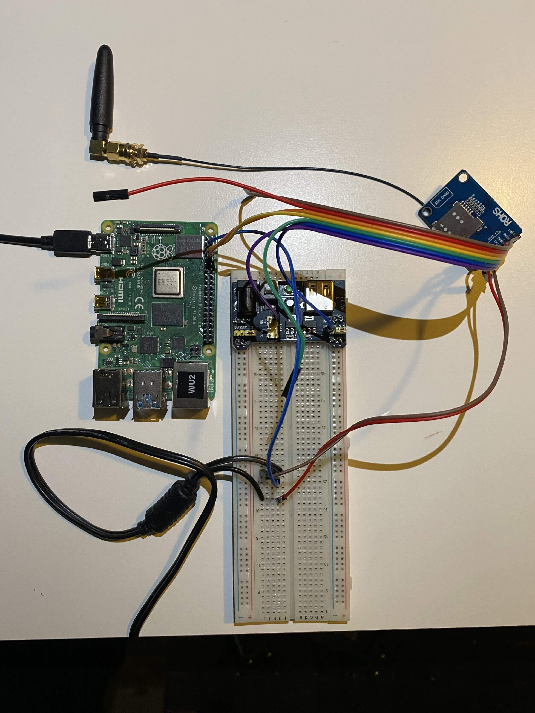
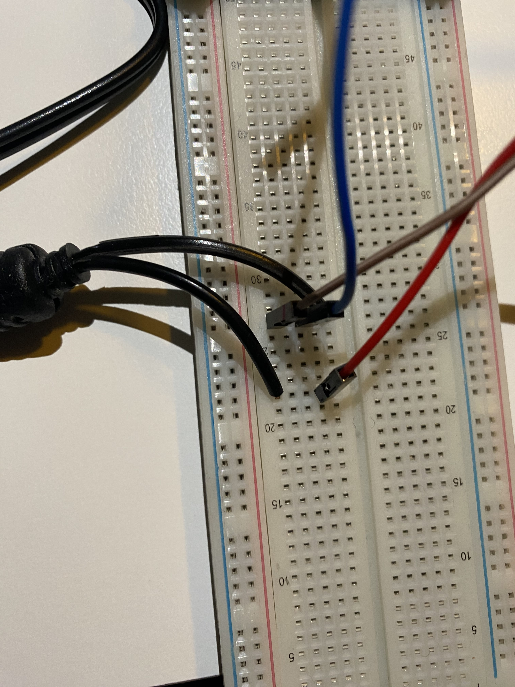
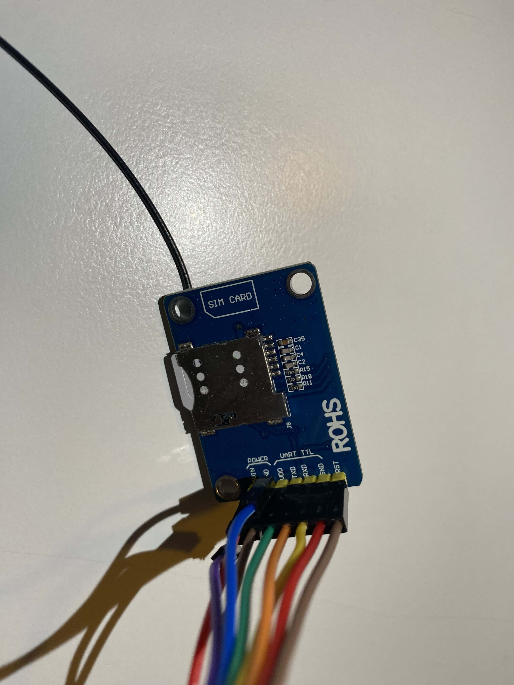

# Raspberry SMS Agent

**Raspberry SMS Agent** is a Node.js application running on a Raspberry Pi. It uses the SIM800L module to periodically poll an external server for commands and sends SMS responses based on the commands received. This setup ensures secure and automated SMS command retrieval and dispatch for IoT applications, without requiring a static IP.

## Project Setup Images

Below are images of the hardware setup:






## Installation

To get started with the Raspberry SMS Agent, follow these steps:

1. **Install Node.js:**
   Ensure Node.js and npm are installed on your Raspberry Pi:
   ```bash
   sudo apt update
   sudo apt install nodejs npm```
Clone the Repository:
Clone this repository to your Raspberry Pi:

```bash
git clone https://github.com/yourusername/raspberry-sms-agent.git
cd raspberry-sms-agent```
Install Dependencies:
Install the necessary Node.js packages:
```
npm install
```
Usage
To start the service, run the following command in the project directory:

```
node src/index.js
```
The service will check for new SMS commands from the external server every 5 minutes and respond as necessary.
